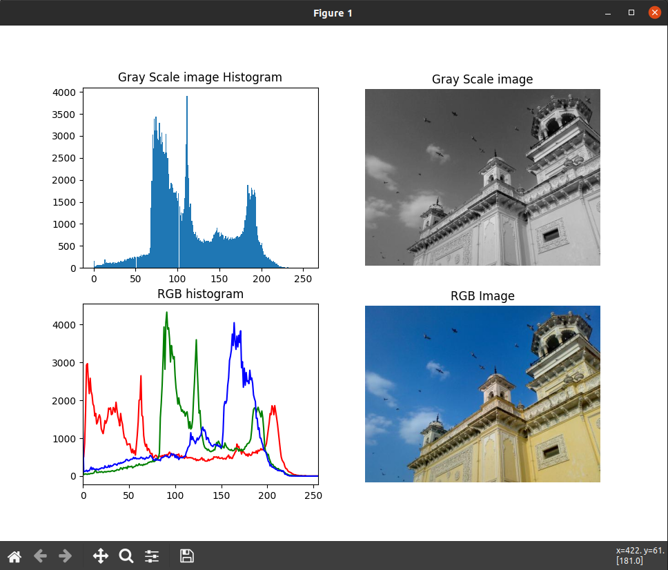

# OpenCV 
## Propósitos con fines de aprendizaje... 
Hola a todos, bienvenido al módulo de ejemplos de OpenCV, una potente librería con propósitos de procesado de imágenes, uso de redes neuronales para modelos de Inteligencia Artificial, usos en robótica, domótica y mucho más.

### Usaremos Python3 versión 3.8
> Desarrollo:
> ##### Cristian Hurtado Diaz
> Desarrollador de Software, Tecnólogo Electrónica Industrial, Máster Inteligencia Atificial
> ##### `email`: cristian04.97@hotmail.com
> ##### `Linkedin`: [Cristian Diaz](https://www.linkedin.com/in/cristian-diaz-software-engineer/) 

---
## Preparación de ambiente:
Es importante instalar en nuestro ambiente o máquina, las librerías necesarias:

| lib              | command                           | uso                                 |  
|------------------|-----------------------------------|-------------------------------------|
| pip3             | sudo apt install python3-pip      | Manager de librerías para Python3   |
| OpenCV           | pip3 install opencv-python        | Procesado de imágenes               |
| sckit-learn      | pip3 install scikit-learn         | Paquete con modelos de ML           |
| sckit-image      | pip3 install scikit-image         | Paquete procesado imágenes          |
| numpy            | pip3 install numpy                | Lib para procesado de matrices      |
| matplotlib       | pip3 install matplotlib           | Lib para procesado gráficas         |

Para automatizar las instalaciones podemos correr el archivo ejecutable `install.sh` que básicamente instala estas librerías por nosotros, para correrlo usaremos:

``` bash
chmod u+x install.sh     # Asignamos permisos de ejecución
./install.sh             # Corremos el script
```
esto correrá el script y tendremos nuestras librerías instaladas.

## > Introducción OpenCV
En este módulo, crearemos figuras comunes sobre un render de openCV.

[openCV_introduction.py](./openCV_introduction.py)

command:

``` python
python3 -m openCV_introduction
```
lo que generará:


## > Roya Detector
La roya, es un hongo que crece sobre algunas hojas de arbol, su color es naranja tendiendo a ser fluorecente, analicemos una imagen y detectemos este hongo.

[roya_detection.py](./roya_detection.py)

command:
``` bash
python3 -m roya_detection
```
lo que genera:

|   |  |
|---------|---------|
|  |  |

existen diversas aplicaciones industriales en los que el análisis de imágenes se aplica en el proceso, detectores de calidad de fábricas, procesos de análisis de productos, detección de enfermedades y más usos.

## > Análisis de Histogramas
Los histogramas son un conjunto de información serial que buca representar un comportamiento o patron basado en una variable de relación continua, por ejemplo podemos determinar la cantidad precisa de píxeles en una escala establecida de 0 a 255, que son todos los valores posibles para un tipo de 8 bits, y asi determinar carácterísticas de la imagen.

[monocromatic_histogram.py](./monocromatic_histogram.py)

command:
``` bash
python3 -m monocromatic_histogram
```

lo que genera:



Con un histograma de una imagen podemos aplicar algoritmos de procesamiento con el fin de detectar patrones como el nivel de claridad o oscuridad de una imagen, el color predominante y demás.